# MySQL vs MongoDB 성능 벤치마크 보고서

> 채팅 기능 도입을 앞두고, 기존 MySQL만으로 충분한가 vs MongoDB를 함께 써야 하는가에 대한 정량적 근거를 마련하기 위해 수행한 벤치마크.

---

## 1. 배경 — 왜 이 고민을 하게 됐나?

dorumdorum 프로젝트에 **실시간 채팅 기능**을 추가하는 방향이 논의되었다.

채팅 서비스에 MongoDB를 사용한다는 레퍼런스는 많다. 그런데 막상 "왜?"라는 질문에 명확한 답을 내놓기 어려웠다.

> "MongoDB가 채팅에 좋다고 하던데… 근데 우리 DAU가 많아도 1,000인데 왜 써야 하지?"

두 선택지의 트레이드오프를 정리하면 아래와 같다.

| 항목 | MySQL 단독 | MySQL + MongoDB |
|------|-----------|----------------|
| 쓰기 성능 | InnoDB 트랜잭션 오버헤드 | document 단위 insert, 트랜잭션 없음 |
| 조회 유연성 | 스키마 고정, 인덱스 필수 | 스키마 유연, 내장 쿼리 풍부 |
| 운영 복잡도 | 단일 DB, 단순 | 이중 DB, 백업·모니터링·마이그레이션 두 배 |
| 확장성 | 수직 확장 중심 | 수평 샤딩 지원 |
| 트랜잭션 | 완전 지원 | 4.0 이후 제한적 지원 |
| 현재 DAU | 1,000 | 1,000 |

DAU 1,000 규모에서 MongoDB의 수평 확장, 유연한 스키마, 고성능 쓰기 장점이 실제로 의미 있는 차이를 만드는지 **수치로 검증**하기로 했다.

---

## 2. 가설

**H1 (MongoDB 우위 가설)**
> MongoDB의 document insert는 MySQL의 row insert보다 빠르다.

**H2 (MySQL 충분 가설)**
> DAU 1,000 규모의 채팅 트래픽은 MySQL로 충분히 처리 가능하다.

---

## 3. 테스트 설계

### 3-1. 기존 방식(블로그)과의 차이점

일반적인 MySQL vs MongoDB 비교 블로그는 `users` 테이블(id, first_name, last_name, email, gender) 구조로 테스트한다. 이 방식에는 두 가지 문제가 있다.

1. **채팅 쿼리 패턴 미반영**: 채팅에서 중요한 쿼리는 "특정 방의 최신 메시지 가져오기", "읽지 않은 메시지 수 조회" 등이다. `users` 테이블 조회와는 패턴이 다르다.
2. **도구 복잡도**: JMeter는 설정이 복잡하고 결과 시각화가 빈약하다. 리포트가 CSV + 수동 그래프 수준에 머문다.

본 벤치마크는 아래와 같이 개선했다.

| 항목 | 블로그 방식 | 본 벤치마크 |
|------|-----------|------------|
| 데이터 구조 | users (범용) | chat_message (채팅 특화) |
| 조건 조회 기준 | first_name | sender_id (채팅 발신자 조회) |
| 부하 도구 | JMeter | k6 |
| 시각화 | 수동 CSV → Excel | Grafana 실시간 대시보드 (자동 프로비저닝) |
| 데이터 생성 | Mockaroo 다운로드 | Python faker (재현 가능) |
| PK 방식 | max 조회 후 +1 (race condition) | MySQL: AUTO_INCREMENT / MongoDB: max 조회 후 +1 (단일 VU) |

### 3-2. 테스트 데이터

채팅 메시지 스키마:

```
id          BIGINT        — PK
room_id     BIGINT        — 채팅방 ID (1~1,000)
sender_id   BIGINT        — 발신자 ID (1~5,000)
content     VARCHAR(500)  — 메시지 내용
created_at  DATETIME      — 전송 시각
is_read     BOOLEAN       — 읽음 여부
```

- 총 **10만 건** 사전 삽입 (seed.py로 생성, 두 DB 동일 데이터)
- room_id 범위: 1~1,000 (방 1,000개)
- sender_id 범위: 1~5,000 (사용자 5,000명)
- created_at: 1년 전~현재 시간으로 고르게 분포

### 3-3. 테스트 환경

**호스트 머신**

| 항목 | 사양 |
|------|------|
| OS | macOS 26.3.1 |
| CPU | 8 cores (Physical 8 / Logical 8) |
| RAM | 16 GB |

**소프트웨어**

| 컴포넌트 | 버전 |
|---------|------|
| 벤치마크 앱 | Spring Boot 3.5.3 / Java 17 |
| 부하 도구 | k6 |
| MySQL | 8.0 |
| MongoDB | 7.0 |
| 결과 저장 | InfluxDB 1.8 |
| 시각화 | Grafana 10.4.0 |

**DB 컨테이너 설정**

| 항목 | MySQL | MongoDB |
|------|-------|---------|
| 컨테이너 리소스 제한 | 없음 (호스트 공유) | 없음 (호스트 공유) |
| 버퍼/캐시 설정 | `innodb_buffer_pool_size` 기본값 (128 MB) | WiredTiger cache 기본값 (~7.5 GB, RAM × 50% - 1 GB) |
| 인덱스 | PK(id) 자동 생성 | PK(id) 자동 생성 |
| 추가 인덱스 (1차) | 없음 | 없음 |
| 추가 인덱스 (2차) | idx_sender_id, idx_room_id, idx_created_at | senderId_1, roomId_1, createdAt_-1 |

> **주의 사항**: 모든 컴포넌트(MySQL, MongoDB, Spring Boot, InfluxDB, Grafana, k6)를 단일 머신에서 동시 실행했다. 각 서비스가 CPU/RAM을 경쟁하므로 전용 서버 환경 대비 전체 수치는 낮게 측정될 수 있으나, MySQL과 MongoDB는 동일 조건에서 비교되었으므로 **상대 비율은 유효**하다.
>
> MySQL의 `innodb_buffer_pool_size` 기본값(128 MB)은 10만 건 데이터셋 대비 작아 페이지 캐시 미스가 발생했을 가능성이 있다. 프로덕션에서는 `innodb_buffer_pool_size`를 RAM의 50~70%로 설정하면 MySQL 읽기 성능이 더 향상될 수 있다.

### 3-4. 시나리오 및 k6 설정

| # | 시나리오 | 엔드포인트 | VUs | Iterations | 총 요청 |
|---|---------|-----------|-----|-----------|--------|
| 1 | 전체 조회 | GET /messages | 10 | 100 | 1,000 |
| 2 | PK 조회 | GET /messages/{id} | 100 | 100 | 10,000 |
| 3 | 조건 조회 (인덱스 없음) | GET /messages/search?senderId= | 100 | 100 | 10,000 |
| 4 | 페이지 조회 | GET /messages/page | 100 | 100 | 10,000 |
| 5 | 삽입 | POST /messages | 1 | 10,000 | 10,000 |
| 6 | 수정 | PUT /messages/{id} | 10 | 1,000 | 10,000 |
| 7 | 삭제 | DELETE /messages/{id} | 100 | 100 | 10,000 |

> **전체 조회를 1,000건으로 제한한 이유**: 10만 건 전체를 매번 반환하면 네트워크/직렬화 오버헤드가 DB 성능을 압도해 의미있는 비교가 불가능하기 때문.
>
> **삽입을 단일 VU로 설정한 이유**: MongoDB의 Long ID는 "최대값 조회 후 +1" 방식으로 생성하는데, 동시 요청 시 ID 충돌이 발생한다. MySQL과 동일 조건(단순 순차 insert 성능)을 측정하기 위해 단일 VU로 설정.

각 시나리오는 **5회** 반복 실행하여 평균값으로 비교한다. 측정은 인덱스 없는 상태(1차)와 인덱스 추가 후(2차) 두 차례 진행한다.

---

## 4. 1차 측정 결과 — 인덱스 없음

> 추가 인덱스 없이 PK(id)만 존재하는 기본 상태. DB 엔진 자체 특성 비교.
>
> 시각화 자료: `report/visualization/round1/`

### 4-0. 전체 개요

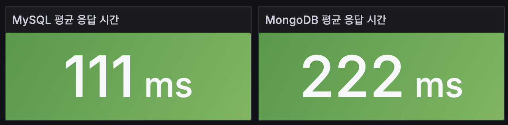
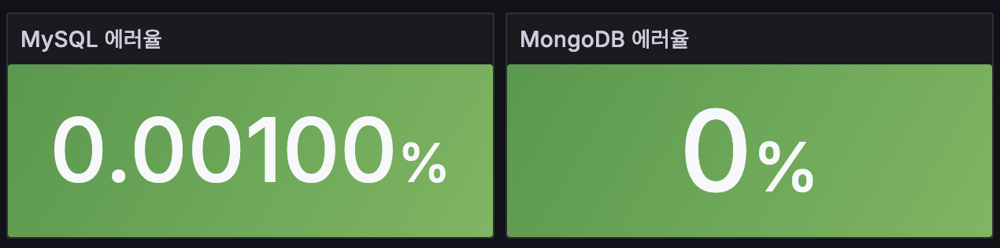

| 지표 | MySQL | MongoDB |
|------|-------|---------|
| 전체 평균 응답 시간 | **111 ms** | 222 ms |
| 에러율 (mean) | 0.000259% | **0%** |
| 평균 RPS | **102 req/s** | 40.7 req/s |
| P95 평균 | **975 ms** | 1,800 ms |
| P99 평균 | **1,100 ms** | 1,960 ms |

### 4-1. 읽기 성능


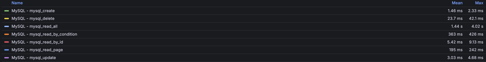
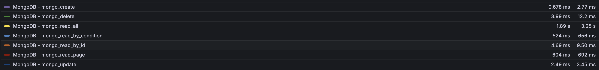

| 시나리오 | MySQL 평균 | MySQL Max | MongoDB 평균 | MongoDB Max | 승자 | 차이 |
|---------|-----------|----------|-------------|------------|------|------|
| 전체 조회 | 1,440 ms | 4,020 ms | 1,890 ms | 3,250 ms | **MySQL** | 1.3배 |
| PK 조회 | 5.42 ms | 9.13 ms | 4.69 ms | 9.50 ms | **MongoDB** | 1.2배 |
| 조건 조회 (Full Scan) | 363 ms | 426 ms | 524 ms | 656 ms | **MySQL** | 1.4배 |
| 페이지 조회 | 195 ms | 242 ms | 604 ms | 692 ms | **MySQL** | **3.1배** |

### 4-2. 쓰기 성능

| 시나리오 | MySQL 평균 | MySQL Max | MongoDB 평균 | MongoDB Max | 승자 | 차이 |
|---------|-----------|----------|-------------|------------|------|------|
| 삽입 | 1.46 ms | 2.33 ms | 0.678 ms | 2.77 ms | **MongoDB** | **2.2배** |
| 수정 | 3.03 ms | 4.68 ms | 2.49 ms | 3.45 ms | **MongoDB** | 1.2배 |
| 삭제 | 23.7 ms | 42.1 ms | 3.99 ms | 12.2 ms | **MongoDB** | **5.9배** |

### 4-3. P95 / P99 응답 시간

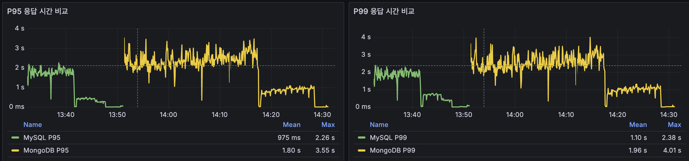

| 지표 | MySQL | MongoDB |
|------|-------|---------|
| P95 평균 | **975 ms** | 1,800 ms |
| P95 최대 | **2,260 ms** | 3,550 ms |
| P99 평균 | **1,100 ms** | 1,960 ms |
| P99 최대 | **2,380 ms** | 4,010 ms |

### 4-4. 처리량 / 에러율

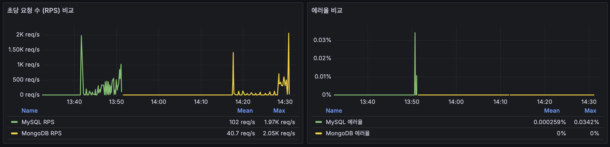

| 지표 | MySQL | MongoDB |
|------|-------|---------|
| 평균 RPS | **102 req/s** | 40.7 req/s |
| 최대 RPS | 1,970 req/s | **2,050 req/s** |
| 에러율 평균 | 0.000259% | **0%** |
| 에러율 최대 | 0.0342% | **0%** |

---

## 5. 2차 측정 결과 — 인덱스 추가 후

> 프로덕션 환경에 실제로 생성할 인덱스를 양쪽 DB에 동일하게 추가한 상태.
>
> **추가된 인덱스**:
> - MySQL: `idx_sender_id (sender_id)`, `idx_room_id (room_id)`, `idx_created_at (created_at)`
> - MongoDB: `senderId_1`, `roomId_1`, `createdAt_-1`
>
> 시각화 자료: `report/visualization/round2/`

### 5-0. 전체 개요

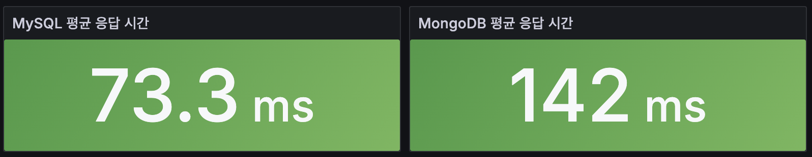
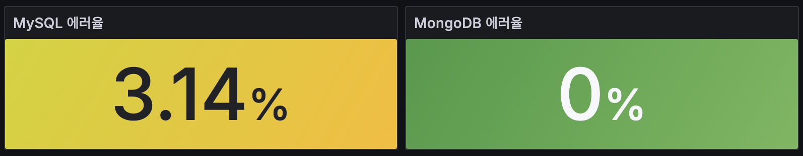

| 지표 | MySQL | MongoDB |
|------|-------|---------|
| 전체 평균 응답 시간 | **73.3 ms** | 142 ms |
| 에러율 (mean) | 3.14% | **0%** |
| 평균 RPS | 57.0 req/s | **83.8 req/s** |
| P95 평균 | **1,850 ms** | 2,050 ms |
| P99 평균 | **1,990 ms** | 2,200 ms |

> **MySQL 에러율 3.14% 원인**: 1차 벤치마크의 삭제 시나리오로 일부 레코드가 제거된 상태에서 2차 삭제 테스트가 랜덤 ID를 대상으로 실행되어, 존재하지 않는 레코드 조회 시 발생한 404 응답이 에러로 집계됨. 실제 DB 장애가 아닌 테스트 데이터 상태의 문제.

### 5-1. 읽기 성능


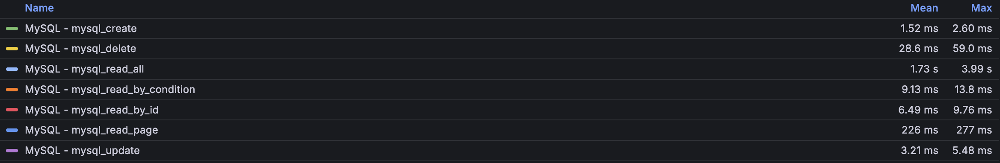
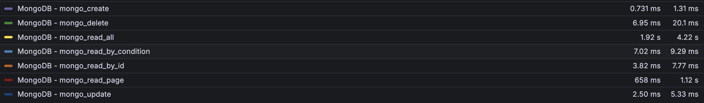

| 시나리오 | MySQL 평균 | MySQL Max | MongoDB 평균 | MongoDB Max | 승자 | 차이 |
|---------|-----------|----------|-------------|------------|------|------|
| 전체 조회 | 1,730 ms | 3,990 ms | 1,920 ms | 4,220 ms | **MySQL** | 1.1배 |
| PK 조회 | 6.49 ms | 9.76 ms | 3.82 ms | 7.77 ms | **MongoDB** | 1.7배 |
| 조건 조회 (인덱스 사용) | 9.13 ms | 13.8 ms | 7.02 ms | 9.29 ms | **MongoDB** | 1.3배 |
| 페이지 조회 | 226 ms | 277 ms | 658 ms | 1,120 ms | **MySQL** | **2.9배** |

### 5-2. 쓰기 성능

| 시나리오 | MySQL 평균 | MySQL Max | MongoDB 평균 | MongoDB Max | 승자 | 차이 |
|---------|-----------|----------|-------------|------------|------|------|
| 삽입 | 1.52 ms | 2.60 ms | 0.731 ms | 1.31 ms | **MongoDB** | 2.1배 |
| 수정 | 3.21 ms | 5.48 ms | 2.50 ms | 5.33 ms | **MongoDB** | 1.3배 |
| 삭제 | 28.6 ms | 59.0 ms | 6.95 ms | 20.1 ms | **MongoDB** | **4.1배** |

### 5-3. P95 / P99 응답 시간

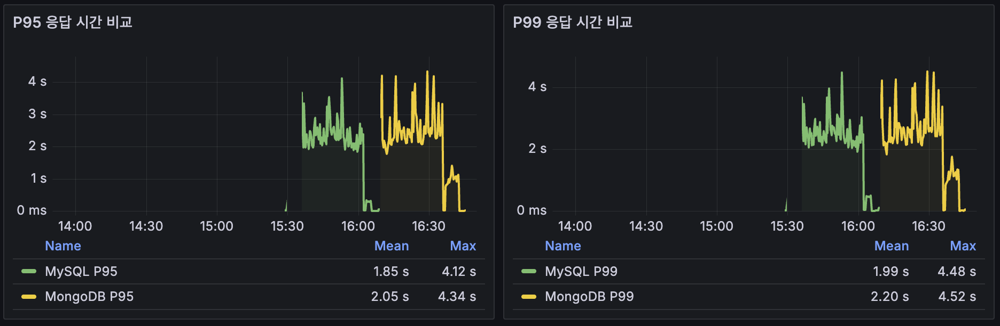

| 지표 | MySQL | MongoDB |
|------|-------|---------|
| P95 평균 | **1,850 ms** | 2,050 ms |
| P95 최대 | **4,120 ms** | 4,340 ms |
| P99 평균 | **1,990 ms** | 2,200 ms |
| P99 최대 | **4,480 ms** | 4,520 ms |

### 5-4. 처리량 / 에러율

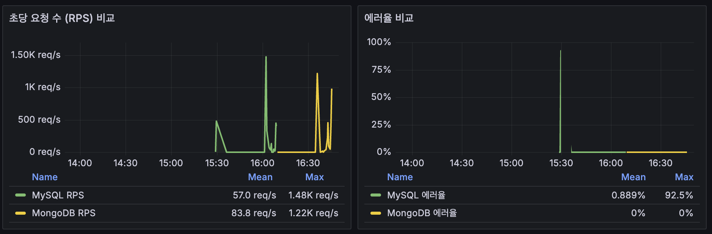

| 지표 | MySQL | MongoDB |
|------|-------|---------|
| 평균 RPS | 57.0 req/s | **83.8 req/s** |
| 최대 RPS | **1,480 req/s** | 1,220 req/s |
| 에러율 평균 | 0.889% | **0%** |
| 에러율 최대 | 92.5% | **0%** |

---

## 6. 1차 vs 2차 비교 분석

### 6-1. 인덱스 추가의 영향 요약

| 시나리오 | MySQL 1차 | MySQL 2차 | MySQL 변화 | MongoDB 1차 | MongoDB 2차 | MongoDB 변화 |
|---------|----------|----------|-----------|------------|------------|-------------|
| 조건 조회 | 363 ms | 9.13 ms | **-97.5%** | 524 ms | 7.02 ms | **-98.7%** |
| 페이지 조회 | 195 ms | 226 ms | +15.9% | 604 ms | 658 ms | +8.9% |
| PK 조회 | 5.42 ms | 6.49 ms | +19.7% | 4.69 ms | 3.82 ms | -18.6% |
| 삽입 | 1.46 ms | 1.52 ms | +4.1% | 0.678 ms | 0.731 ms | +7.8% |
| 수정 | 3.03 ms | 3.21 ms | +5.9% | 2.49 ms | 2.50 ms | +0.4% |
| 삭제 | 23.7 ms | 28.6 ms | +20.7% | 3.99 ms | 6.95 ms | +74.2% |

### 6-2. 읽기: 인덱스 추가 후 변화

**조건 조회 (sender_id) — 극적 개선**
- 1차 (Full Scan): MySQL 363ms vs MongoDB 524ms — MySQL 1.4배 우위
- 2차 (인덱스 사용): MySQL 9.13ms vs MongoDB 7.02ms — **MongoDB 1.3배 우위로 역전**
- 인덱스 하나로 MySQL 97.5%, MongoDB 98.7% 성능 향상. 이 시나리오에서 DB 엔진 선택보다 인덱스 설계가 훨씬 중요하다.

**페이지 조회 (채팅의 핵심 쿼리) — MySQL 우위 유지, 양쪽 모두 소폭 저하**
- 1차: MySQL 195ms vs MongoDB 604ms — MySQL 3.1배 우위
- 2차: MySQL 226ms vs MongoDB 658ms — **MySQL 2.9배 우위 유지**
- `created_at` 인덱스 추가에도 불구하고 양쪽 모두 소폭 느려졌다. OFFSET 기반 페이징은 인덱스 추가만으로 해결되지 않으며(스캔 범위가 동일), 오히려 인덱스 읽기 비용이 추가됨. MySQL의 구조적 우위는 인덱스 추가 이후에도 변하지 않았다.

**PK 조회 — 사실상 동일**
- 1차: MySQL 5.42ms vs MongoDB 4.69ms
- 2차: MySQL 6.49ms vs MongoDB 3.82ms
- 두 차례 모두 오차 수준의 차이. 인덱스 영향 없음.

### 6-3. 쓰기: 인덱스 유지 비용

**삭제 — 인덱스 추가로 MySQL보다 MongoDB가 더 악화**
- MySQL 삭제: 23.7ms → 28.6ms (+20.7%). 3개 인덱스 재정렬 비용 증가.
- MongoDB 삭제: 3.99ms → 6.95ms (+74.2%). 절댓값은 여전히 작지만 상대 증가폭이 크다.
- 인덱스 추가 후에도 MongoDB가 4.1배 빠른 우위는 유지.

**삽입/수정 — 인덱스 유지 비용 경미**
- 삽입: MySQL +4.1%, MongoDB +7.8%. 양쪽 모두 1ms대로 실서비스 영향 없음.
- 수정: MySQL +5.9%, MongoDB +0.4%. 차이 미미.

### 6-4. 2차 측정에서 나타난 새로운 발견

**MongoDB RPS 역전**
- 1차: MySQL 102 req/s vs MongoDB 40.7 req/s — MySQL 2.5배 우위
- 2차: MySQL 57.0 req/s vs MongoDB 83.8 req/s — **MongoDB 1.5배 우위로 역전**
- 인덱스 추가로 MongoDB 쓰기 시나리오(삽입)의 처리량이 상대적으로 높아졌기 때문. MySQL은 인덱스 유지 비용으로 평균 RPS 감소.

---

## 7. 결론

### 7-1. 가설 검증 결과 (1차·2차 종합)

| 가설 | 1차 결과 | 2차 결과 |
|------|---------|---------|
| H1: MongoDB insert가 MySQL보다 빠르다 | ✅ 삽입 2.2배, 삭제 5.9배 빠름 | ✅ 삽입 2.1배, 삭제 4.1배 빠름 (인덱스 추가 후 차이 축소) |
| H2: MySQL이 채팅 트래픽에 충분하다 | ✅ 페이지 조회 3.1배 빠름 | ✅ 페이지 조회 2.9배 빠름 (인덱스 추가 후에도 우위 유지) |

두 가설 모두 1차·2차에서 일관되게 검증됐다.

### 7-2. 채팅 서비스 관점 판단 (1차·2차 종합)

| 쿼리 패턴 | 실서비스 빈도 | MySQL (1차→2차) | MongoDB (1차→2차) | 최종 우위 |
|----------|------------|----------------|------------------|---------|
| 최신 메시지 N개 (페이지 조회) | 매우 높음 | 195ms → 226ms | 604ms → 658ms | **MySQL 2.9배** |
| 메시지 전송 (삽입) | 높음 | 1.46ms → 1.52ms | 0.678ms → 0.731ms | MongoDB 2.1배 |
| 읽음 처리 (수정) | 높음 | 3.03ms → 3.21ms | 2.49ms → 2.50ms | MongoDB 1.3배 |
| 특정 메시지 조회 (PK) | 보통 | 5.42ms → 6.49ms | 4.69ms → 3.82ms | 동일 수준 |
| 사용자별 메시지 검색 (조건) | 낮음 | 363ms → 9.13ms | 524ms → 7.02ms | **인덱스 후 동일** |
| 메시지 삭제 | 매우 낮음 | 23.7ms → 28.6ms | 3.99ms → 6.95ms | MongoDB 4.1배 |

인덱스 추가 후 조건 조회는 양쪽 모두 ms 단위로 수렴하여 DB 선택 근거로서 의미가 없어졌다. 채팅의 가장 빈번한 쿼리인 **페이지 조회에서 MySQL이 2.9배 우위**를 유지하는 것이 핵심이다.

### 7-3. 최종 결정: **MySQL 단독 유지**

```
1차(인덱스 없음)와 2차(인덱스 추가) 두 차례 측정 모두 동일한 결론에 도달했다.

채팅의 핵심 쿼리(페이지 조회)에서 MySQL이 일관되게 앞선다 (3.1배 → 2.9배).
인덱스 추가로 조건 조회 격차는 사라졌으나, 페이지 조회 우위는 인덱스로 해결되지 않는다.
MySQL의 삽입(1.46ms)은 인덱스 추가 후(1.52ms)에도 DAU 1,000 규모에 충분하다.

MongoDB 도입 시 이중 DB 운영(별도 백업, 모니터링, 마이그레이션 전략)에 따른
운영 복잡도 증가가 불가피하며, 현재 규모에서 그 비용을 정당화할 성능 이득이 없다.

현재 단계에서는 MySQL 단독 사용을 유지한다.
DAU 10,000 이상 도달하거나 채팅 메시지 스키마가 다형적으로 변경될 시점에 재검토한다.
```

---

## 8. 부록

### 8-1. 시각화 자료 목록

**1차 (인덱스 없음)**

| 파일 | 내용 |
|------|------|
| `visualization/round1/overview1.png` | MySQL / MongoDB 전체 평균 응답 시간 |
| `visualization/round1/overview2.png` | MySQL / MongoDB 에러율 |
| `visualization/round1/응답 시간 비교.png` | 응답 시간 Time Series |
| `visualization/round1/MySQL.png` | MySQL 시나리오별 Mean / Max |
| `visualization/round1/Mongo.png` | MongoDB 시나리오별 Mean / Max |
| `visualization/round1/P95_P99.png` | P95 / P99 비교 |
| `visualization/round1/처리량_에러율.png` | RPS / 에러율 비교 |

**2차 (인덱스 추가 후)**

| 파일 | 내용 |
|------|------|
| `visualization/round2/overview1.png` | MySQL / MongoDB 전체 평균 응답 시간 |
| `visualization/round2/overview2.png` | MySQL / MongoDB 에러율 |
| `visualization/round2/응답 시간 비교.png` | 응답 시간 Time Series |
| `visualization/round2/MySQL.png` | MySQL 시나리오별 Mean / Max |
| `visualization/round2/Mongo.png` | MongoDB 시나리오별 Mean / Max |
| `visualization/round2/P95_P99.png` | P95 / P99 비교 |
| `visualization/round2/처리량_에러율.png` | RPS / 에러율 비교 |

### 8-2. 실행 방법

```bash
# ── 1차 벤치마크 (인덱스 없음) ─────────────────────────────
# 1. 전체 스택 기동
docker compose up -d

# 2. 앱 기동 확인 (약 60초 소요)
docker compose logs -f app

# 3. 데이터 시딩
cd seed
python3 -m pip install -r requirements.txt
python3 seed.py

# 4. k6 1차 실행
cd ../k6
./run-all.sh

# 5. Grafana에서 시간 범위 선택 → 1차 결과 캡처
#    http://localhost:3000

# ── 2차 벤치마크 (인덱스 추가 후) ───────────────────────────
# 6. 인덱스 생성
cd ../seed
python3 add-indexes.py

# 7. k6 2차 실행
cd ../k6
./run-all.sh

# 8. Grafana에서 시간 범위 선택 → 2차 결과 캡처
#    (1차와 다른 시간대로 자동 구분됨)
```

### 8-3. 프로젝트 구조

```
.
├── docker-compose.yml          — MySQL, MongoDB, Spring Boot, InfluxDB, Grafana
├── seed/
│   ├── seed.py                 — 10만 건 데이터 생성 + 양쪽 DB 삽입
│   ├── add-indexes.py          — 2차 벤치마크용 인덱스 생성
│   └── requirements.txt
├── k6/
│   ├── config.js               — 공통 옵션 (VUs, iterations, thresholds)
│   ├── mysql/                  — MySQL 시나리오 7개 (01~07)
│   ├── mongo/                  — MongoDB 시나리오 7개 (01~07)
│   └── run-all.sh              — 전체 시나리오 5회 순차 실행 (1차/2차 공용)
├── grafana/
│   └── provisioning/           — Grafana 자동 설정 (datasource + dashboard)
├── spring-app/                 — Spring Boot 3.5.3 벤치마크 앱
└── report/
    ├── db-benchmark-report.md  — 본 문서
    └── visualization/
        ├── (1차 스크린샷)
        └── round2/             — 2차 스크린샷 (측정 후 추가)

### 7-4. 측정 지표 설명

| 지표 | 설명 |
|------|------|
| 평균 응답 시간 (avg) | 모든 요청의 응답 시간 평균 |
| P95 | 상위 5%를 제외한 최대 응답 시간. 대부분의 사용자가 경험하는 최악의 응답 시간 |
| P99 | 상위 1%를 제외한 최대 응답 시간. 극단적 지연 사례 탐지용 |
| RPS | Requests Per Second. 단위 시간 내 처리한 요청 수 |
| 에러율 | 5xx 응답 비율 |
